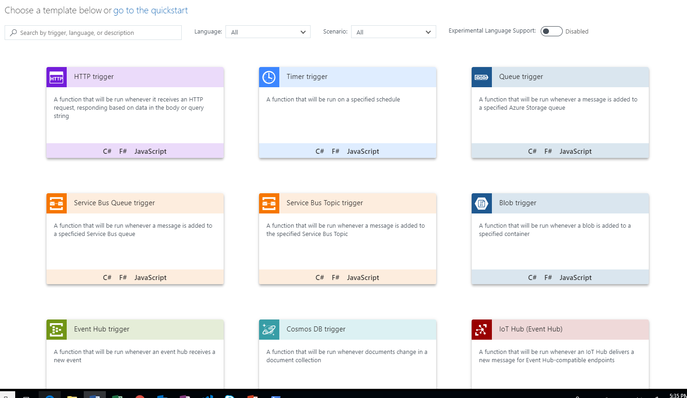
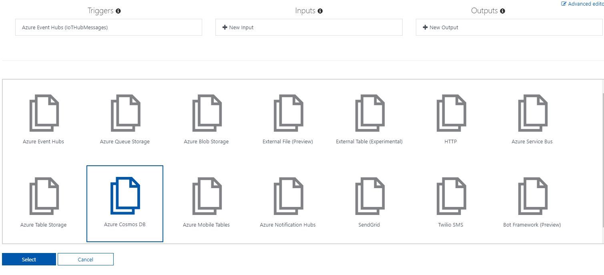
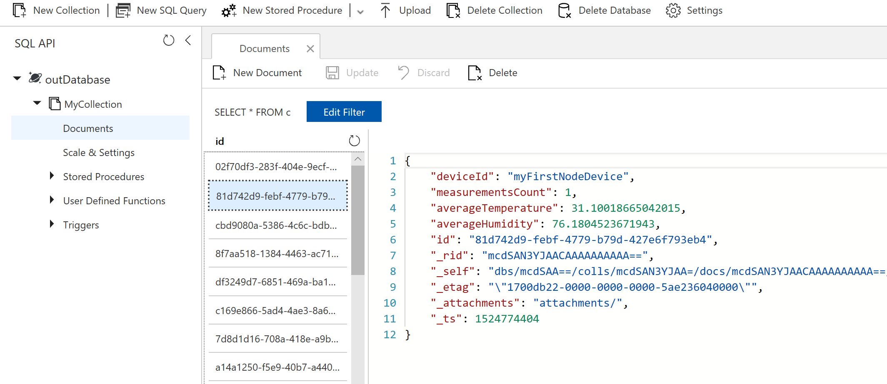

# Processing data from IoT Hub with Azure Functions

In this quick sample you will learn how to capture data from your devices or sensors, perform aggregation, filtering or some other custom processing on this data, and store it on a database. All this will be done by setting up the integration between IoT Hub and Azure Functions, while learning a bit about triggers and bindings for Azure Functions, and drop your processed data on Cosmos DB.

## Features
This sample project will cover the technologies and services below:
* Azure IoT Hub
* Azure Functions (triggers and bindings)
* Cosmos DB

## Getting Started

### Prerequisites
In order to complete this tutorial you will need the following:
- Active Azure subscription (check out the [free account](https://azure.microsoft.com/en-us/free/))
- Device sending messages to IoT Hub or simulator following [this instructions](https://docs.microsoft.com/en-us/azure/iot-hub/iot-hub-get-started-simulated)


## Walkthrough

### Step 1: IoT Hub
First, we need to set up an **IoT Hub** and start sending messages to it. For simplicity, we chose to simulate a real device using our PC. If you’d like to do the same, follow the detailed instructions [here](https://docs.microsoft.com/en-us/azure/iot-hub/iot-hub-get-started-simulated)

**Note:** you can find the necessary folders and files (using JavaScript) already created on this repo, so you can just put your connection strings and get it working right away

This one is super easy, since there’s such great documentation already. All you have to do is choose your preferred stack, create an IoT Hub, copy-paste some code, and run. The only potential snag is authentication – make sure you get those connection strings right!

When we ran through this, we chose to use Node. After completing the instructions above, we left the device simulation active on our machine, which kept pushing events to IoT Hub. Next, we’ll have something react to these events.

### Step 2: Azure Functions triggered by IoT Hub
Azure Functions has integration with IoT Hub out of the box, so it is very simple to get this up and running. Follow the steps below to get an Azure Function reacting to IoT Hub events:

1. Create a **Function App** by clicking the below in the Azure Portal “Create New” blade. This is the “container” which holds your functions.


2. Once the Function is created, navigate to the “Create new function from template page”:



3. Select IoT Hub (Event Hub) and Javascript as the language


4. Conveniently, Azure Functions will create the connection with IoT Hub for you after selecting this template, so you just have to click on the "new" button and select the proper IoT Hub instance:


5. Click "Create" and the Function just created will be triggered by the IoT Hub events


### Step 3: Cosmos DB creation

Now we need a place to store the events sent to IoT Hub after the processing occur on the Function code, so we followed the steps below to create a **Cosmos DB** database:

1. Navigate back to the "Create new" blade in the Azure Portal, and this time select "Cosmos DB"


2. Select SQL as the API to use on Cosmos DB, as it's important to note that Azure Functions only works with Cosmos DB if the SQL or Graph APIs are selected.

3. That's it! It takes a bit for the resource to be provisioned, so give it a few minutes


### Step 4: Cosmos DB output binding

Now it's time to hook everything together using the Azure Functions Cosmos DB output binding, and integrate our Function with it following the steps below:

1. Navigate to the "Integrate" tab of your Azure Function


2. Create a new "Cosmos DB output" binding



3. As with IoT Hub, we have to create a new Cosmos DB Account connection, but again it's quite easy, as you just have to click on "new" and select the proper Cosmos DB account


4. Rather than creating it in Cosmos DB, we opt for the default parameter values and the "Create database and collection for me" option for this sample


5. Now, to modify the code on our Function to store the data on Cosmos DB using the output binding, and since the Function was created in Javascript, all we have to do is add the output to context.bindings

```javascript
module.exports = function (context, IoTHubMessages) {
    context.log(`JavaScript eventhub trigger function called for message array: ${IoTHubMessages}`);

    var count = 0;
    var totalTemperature = 0.0;
    var totalHumidity = 0.0;
    var deviceId = "";

    IoTHubMessages.forEach(message => {
        context.log(`Processed message: ${message}`);
        count++;
        totalTemperature += message.temperature;
        totalHumidity += message.humidity;
        deviceId = message.deviceId;
    });

    var output = {
        "deviceId": deviceId,
        "measurementsCount": count,
        "averageTemperature": totalTemperature/count,
        "averageHumidity": totalHumidity/count
    };

    context.log(`Output content: ${output}`);

    context.bindings.outputDocument = output;

    context.done();
};
```
This will be slightly different if you select a different language (for full reference on how to use Cosmos DB output bindings in Azure Functions see [here](https://docs.microsoft.com/en-us/azure/azure-functions/functions-integrate-store-unstructured-data-cosmosdb))

Note that all we did was to aggregate data calculating average values and output to Cosmos DB, but it's easy to modify the Function code to manipulate the data on any other way before storing on Cosmos DB.

6. To validate that our Function is being properly triggered and storing the IoT Hub messages, navigate to Cosmos DB and watch the messages being stored



## Resources

### Documentation
- [Azure Functions reference](https://docs.microsoft.com/en-us/azure/azure-functions/)
- [Azure IoT Hub reference](https://docs.microsoft.com/en-us/azure/iot-hub/)
- [Azure Serverless computing cookbook](https://azure.microsoft.com/en-us/resources/azure-serverless-computing-cookbook/) free eBook

### Other samples
- [Azure IoT Hub ping sample](https://azure.microsoft.com/en-us/resources/samples/iot-hub-node-ping/)
- [Auto-scale your Azure IoT Hub sample](https://azure.microsoft.com/en-us/resources/samples/iot-hub-dotnet-autoscale/)

### Products info
- [Azure Functions](https://azure.microsoft.com/en-us/services/functions/)
- [Azure IoT Hub](https://azure.microsoft.com/en-us/services/iot-hub/)